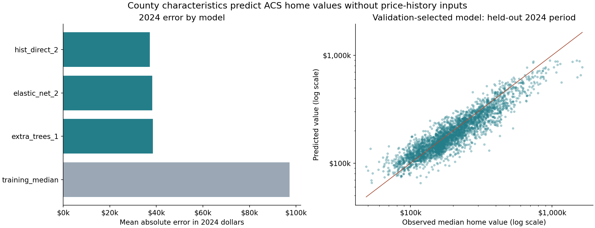
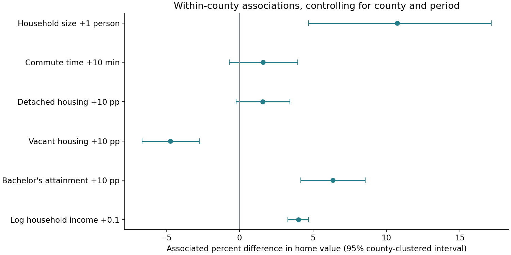

# County characteristics and US home values

## Question and headline finding

The validation-selected model (hist_direct_2) explains 80.1% of the held-out 2024 cross-county variance (R²), with a $37,198 mean absolute error. Its RMSLE is 63.5% lower than the training-median baseline.

These are out-of-period predictions using characteristics measured in the same ACS window as the outcome. They establish predictive association, not causation or advance forecasting.

## Data journey

Existing Census, FEMA, NOAA and climate inputs feed DuckDB marts, then an audited panel of 9,420 county-period observations and 57 primary predictors. The periods are 2010–2014, 2015–2019 and 2020–2024; values are in 2024 dollars. The target is median owner-occupied home value, not transaction price.

See coverage.csv, exclusions.csv, geography_audit.csv, missingness.csv and feature_manifest.csv for the exact sample.



## Model evidence

| Model | 2024 MAE | RMSLE | R² |
|---|---:|---:|---:|
| training_median | $97,194 | 0.573 | -0.280 |
| hist_direct_2 | $37,198 | 0.209 | 0.801 |
| extra_trees_1 | $38,471 | 0.216 | 0.794 |
| elastic_net_2 | $38,250 | 0.218 | 0.809 |

Removing the economic feature group increases 2024 RMSLE the most (24.6%). Group removal uses the fixed selected specification, so it measures reliance by this model rather than a causal contribution.

The separate geographic evaluation gives these unweighted means across five county-disjoint folds:

| Family | Geographic MAE | RMSLE | R² |
|---|---:|---:|---:|
| elastic_net | $27,088 | 0.190 | 0.829 |
| extra_trees | $25,420 | 0.181 | 0.836 |
| hist_gradient_boosting | $24,607 | 0.176 | 0.841 |
| training_median | $66,847 | 0.466 | -0.078 |

Parameters and model family were selected on 2014 → 2019 validation before evaluating 2024. The final evaluation fit uses 2014 and 2019. Geographic evaluation uses five county-disjoint folds with tuning repeated inside each fold on pre-2024 data.

## Within-county associations

The fixed-effects regression uses 3,121 balanced, complete counties. It controls for county and period effects. Intervals use county-clustered standard errors. Its within R² is 0.132, so these six predictors account for a substantially smaller share of variation after removing persistent county differences and common period effects. This R² has a different denominator from the prediction benchmark above.

| Predictor | Log-value coefficient | 95% interval |
|---|---:|---:|
| log1p__median_household_income_2024_usd | 0.3923 | [0.3244, 0.4602] |
| bachelors_degree_or_higher_pct | 0.0062 | [0.0041, 0.0082] |
| vacant_housing_units_pct | -0.0048 | [-0.0069, -0.0028] |
| detached_single_unit_pct | 0.0016 | [-0.0002, 0.0034] |
| mean_commute_time_minutes | 0.0016 | [-0.0007, 0.0039] |
| average_household_size | 0.1021 | [0.0459, 0.1583] |



A percentage predictor is measured in percentage points; log income is in log1p dollars. Cross-county relationships need not have the same sign as within-county changes. See associations_by_period.csv, coefficient_stability.csv and group_permutation.csv for stability diagnostics.

## What characteristics add to forecasting

Adding characteristics changes held-out RMSLE by 2.8% relative to the history-only model (positive means improvement). This separate experiment predicts the next overlapping ACS estimate.

| Design | 2023–2024 MAE | RMSLE |
|---|---:|---:|
| previous_value | $10,955 | 0.067 |
| history_only | $7,719 | 0.056 |
| history_plus_characteristics | $7,538 | 0.055 |

## Website handoff

website_data/counties.json contains FIPS, observed period values, selected characteristics, predictions and residuals. Join it to matching-vintage county boundaries when implementing the county map; geometry is not bundled. The other JSON files support model comparisons, error charts, association plots and response curves. Host these static results; do not train in the browser.

## Limitations

- Observational associations, not causal effects or individual-house appraisals.
- Same-period ACS characteristics estimate home values; this is not advance forecasting.
- Geographic folds are county-disjoint but neighboring counties can remain correlated.
- Fixed-effects sample excludes known changes and incomplete histories; no areal crosswalk.
- Minor boundary changes and ACS margins of error are not modeled.
- Annual forecast labels overlap four ACS survey years; release vintages are not reconstructed.
- 2024 ACS five-year estimates were released January 29, 2026; no operational end-2024 forecast claim.
- Hazard absence is assumed zero in event marts; reporting and mapping gaps may remain.
- Metro labels come from a static reference and are used only for error breakdowns.
- Ablations and explanations are prespecified held-out diagnostics, not model-selection evidence.

## Reproduce

```powershell
python -m src.cli.run_county_characteristics
python -m unittest discover -s tests -v
```

## Sources

- [acs_comparisons](https://www.census.gov/programs-surveys/acs/guidance/comparing-acs-data.html)
- [county_changes](https://www.census.gov/programs-surveys/geography/technical-documentation/county-changes.2010.html)
- [geography_changes](https://www.census.gov/programs-surveys/acs/technical-documentation/table-and-geography-changes.html)
- [release_schedule](https://www.census.gov/programs-surveys/acs/news/data-releases/2024/release-schedule.html)
